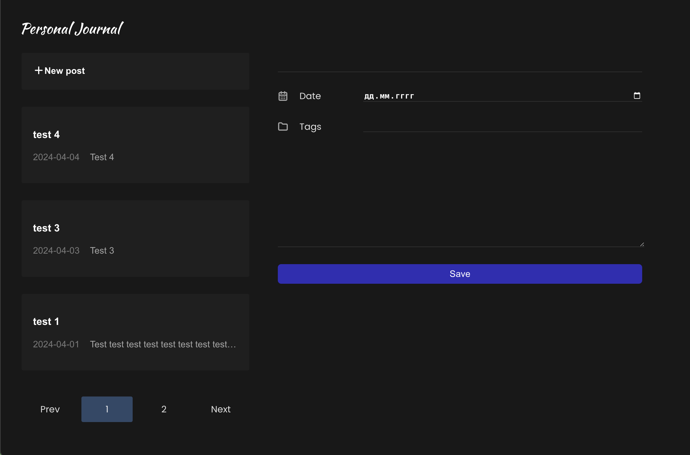

<h1>Personal Journal</h1>

Backend: <strong>Spring Boot + Java</strong>

Frontend: <strong>React + Vite</strong>

Database: <strong>Postgres</strong>

For a quick start, use the <code>docker-compose up</code> command in terminal
and get <code>localhost:8080</code> in browser.

    

